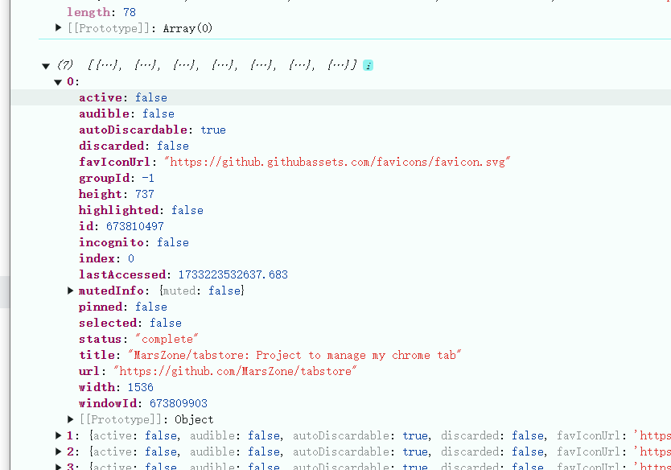

Finished
- 在popup页面，增加一个按钮。点击后获取当前chrome所有tab的信息，打印出来。
  

整个json存起来。
通过https://developer.chrome.com/docs/extensions/reference/api/storage?hl=zh-cn#description 共享存储
storage

tab数据进行同步

--
增加一个category,topic
目录，然后主题
比如说

category-项目开发
     topic-ChromeExtensions开发_年月日时分秒


- 由于chrome限制storage.sync配额限制约为 100 KB。只能用storage.local外加unlimitedStorage来存储。
- 先本地存储，后续增加同步功能，开发个服务器，云端同步，倒也不着急这个。

1.主要流程， 点击popup。下拉选择一个分类，输入主题,默认分组'default'，选择是否关闭当前窗口，点击保存，将数据存起来。
数据结构  done
```
{
     'category':{
          'title':'项目开发'
          'topics':[{
               'title':'ChromeExtensions开发',
               'close':true,
               'group':'default',
               'list':[
                    {}
               ]
          }]
     }
}
```
-. 新增一个页面。在保存按钮下面，加个查看。展示所有的分类。 done
-. 完成跳转查看分类页面信息                             done

# Todo
- PopUp优化,去掉没用的玩意，header footer。done
- 下拉category.       done
- 换一下logo        done
- 点击改名字，SaveTabs。 done
    1.点击，解析，按结构组装数据，按照自定义数据格式保存到Storage.local。
    再加个选项，是否关闭当前页面。 done
要在查看页面增加 OpenAll done

2024-12-16
再增加一个topic删除功能。
- 导入导出数据功能 done

2024-12-13
- 在topic，加一条，删一条功能。 done
- 删除，pop确认                done
- pop追加                     done
- 导出的文件名，年月日。       done
- category 重命名             done
- category 删除
- category 顺序调整
- category 收起展开，配置及功能，默认收起。